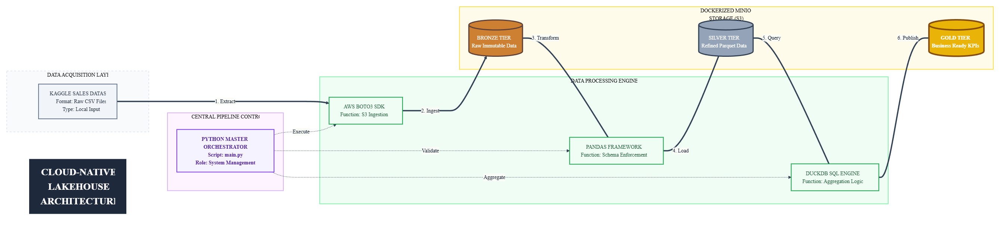

# Cloud-Native Data Lakehouse Pipeline
### End-to-End Medallion Architecture Implementation

<div align="center">
  
  
  
  
  
</div>

---

## Project Overview
This repository contains a production-grade implementation of a **Cloud-Native Data Lakehouse**. The system utilizes the **Medallion Architecture** to automate the journey of raw sales data from ingestion to high-level business intelligence. The primary objective is to ensure data reliability, schema enforcement, and optimized analytical performance within a containerized S3-compatible environment.

## System Architecture
The pipeline follows a linear data refinement strategy, ensuring that each layer adds specific value to the dataset:

<p align="center">
  
</p>

### Data Refinement Layers
* **Bronze Layer (Raw):** Serves as the landing zone for immutable raw data ingested directly from local sources into MinIO S3 buckets.
* **Silver Layer (Refined):** Performs data cleansing, header normalization, and schema enforcement. Data is converted into the **Parquet** columnar format for storage efficiency.
* **Gold Layer (Curated):** Contains aggregated business KPIs and high-level summaries ready for reporting and visualization.

---

## Technical Specifications

| Component | Technology | Functional Role |
| :--- | :--- | :--- |
| **Infrastructure** | **Docker** | Orchestrates containerized services for the MinIO storage environment. |
| **Storage Engine** | **MinIO (S3)** | Provides a cloud-native, S3-compatible object storage for the Medallion layers. |
| **Orchestration** | **Python (main.py)** | Acts as the master controller for sequential pipeline execution and error handling. |
| **Processing** | **Pandas** | Manages data transformation, type casting, and schema validation. |
| **Analytics** | **DuckDB** | Executes high-performance SQL queries for complex data aggregations. |

---

## Implementation Details

### 1. Automated Data Ingestion
The ingestion module leverages the `Boto3` SDK to facilitate secure data transfer between the local development environment and the Bronze storage tier.

### 2. Transformation Logic
The Silver layer transformation ensures data integrity by removing null values and enforcing standard naming conventions. The transition to Parquet significantly reduces storage footprint and enhances query speeds.

### 3. Analytical Views
The Gold layer utilizes the `DuckDB` engine to compute mission-critical metrics, such as total revenue and order volume per region, directly from the refined Silver datasets.

---

## Pipeline Execution and Validation

### Orchestration Sequence
To initialize the end-to-end automated pipeline, execute the master orchestrator from the root directory:
```bash
python main.py
